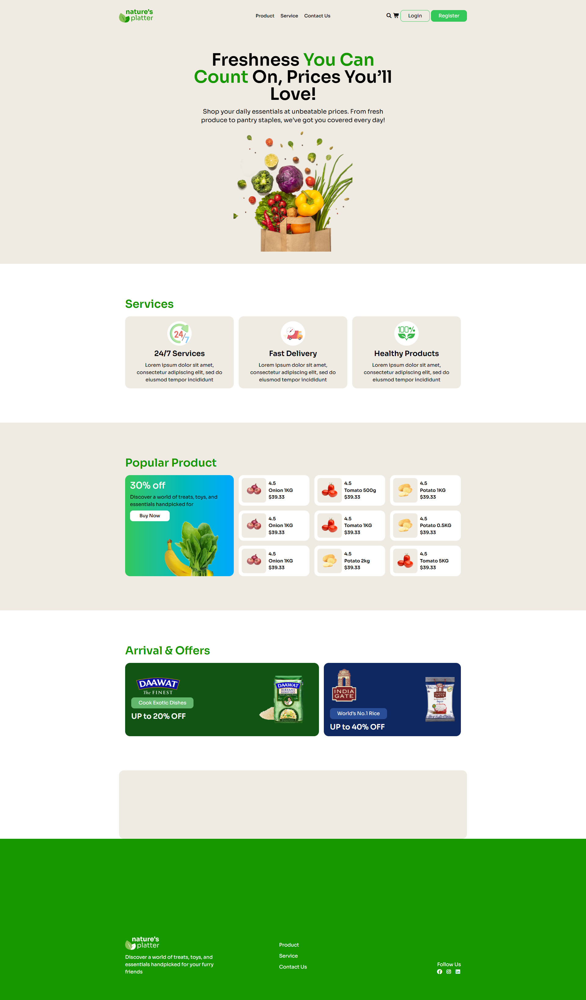

# 🥬 Nature's Platter

A modern and user-friendly grocery website designed to showcase fresh products, services, popular products, and special offers with a clean and attractive layout.

---

## 📊 Project Overview

Nature's Platter is a modern grocery and fresh food website designed with a clean and user-friendly interface. The website showcases fresh products, available services, popular products, promotional offers, and essential navigation options.

---

## 📸 Screenshot



---

## 🛠️ Technologies Used

- HTML5
- Tailwind CSS

---

## ✨ Key Features

### 1. 🧭 Navigation

- Clean and simple navigation bar
- Product, Service, and Contact Us links
- Login and Register buttons
- Shopping cart icon

### 2. 🥬 Hero Section

- Attractive promotional headline
- Fresh grocery product imagery
- Promotional description
- Clean and modern layout

### 3. 🚚 Services Section

- 24/7 Services
- Fast Delivery
- Healthy Products
- Service icons and descriptions

### 4. 🛒 Popular Products

- Product cards with images
- Product names and prices
- Product ratings
- Promotional discount section
- Buy Now button

### 5. 🎁 Arrival & Offers

- Promotional offer banners
- Discount information
- Brand and product promotions

### 6. 📱 Responsive Design

- Responsive layout for desktop, tablet, and mobile devices
- Flexible product and content layouts
- Mobile-friendly design

### 7. 🦶 Footer

- Brand information
- Navigation links
- Social media links
- Follow Us section

---

## 📦 Dependencies

- Tailwind CSS
- External images and icons used in the project

---

## 💻 How to Run Locally

1. Clone or download this repository.
2. Open the project folder in VS Code.
3. Open `index.html` in your browser.
4. You can also use the Live Server extension.
5. No additional setup is required.

---

## 🌐 Live Project

👉 [View Nature's Platter Live Website](https://mehedi-web-dev.github.io/Nature-s-Platter-p/)

---

## 📂 Project Structure

```text
Nature-s-Platter-p/
│
├── assets/
│   ├── Group 9181.png
│   ├── Hero Section 1.png
│   ├── Hero Section-large.png
│   ├── Mask group.png
│   ├── dawat-logo.png
│   ├── delivery.png
│   ├── footer-logo.png
│   ├── gate-logo.png
│   ├── grocery-basket.png
│   ├── natures.png
│   ├── nav-logo.png
│   ├── offers-1.png
│   ├── offers-2.png
│   └── onion.png
│
├── index.html
└── README.md
